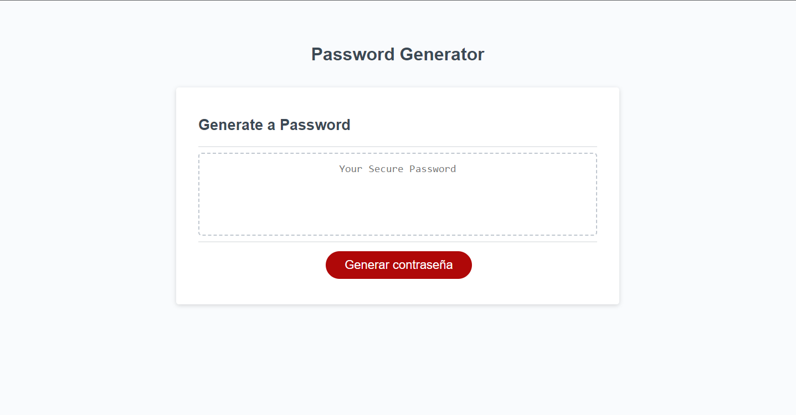
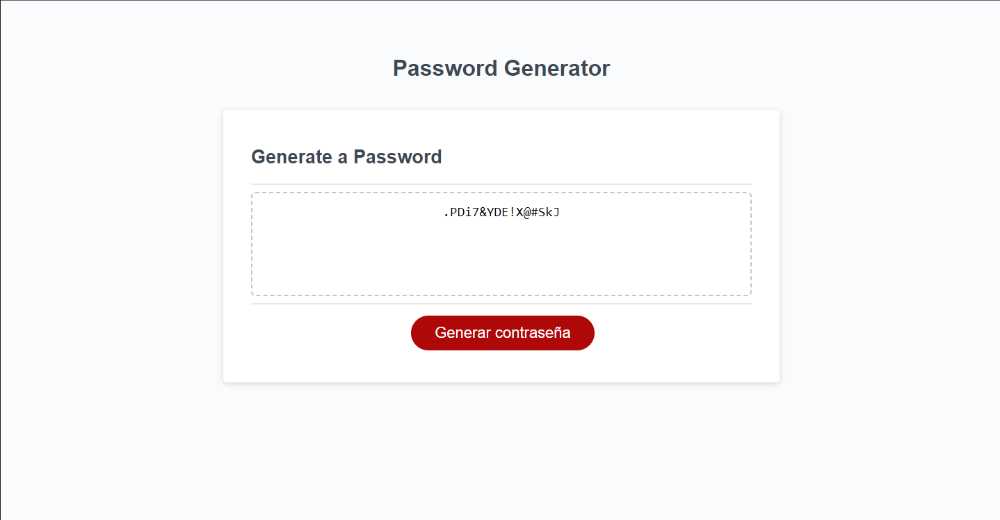
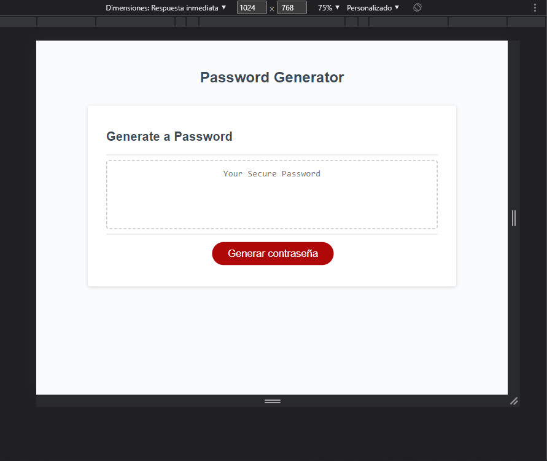
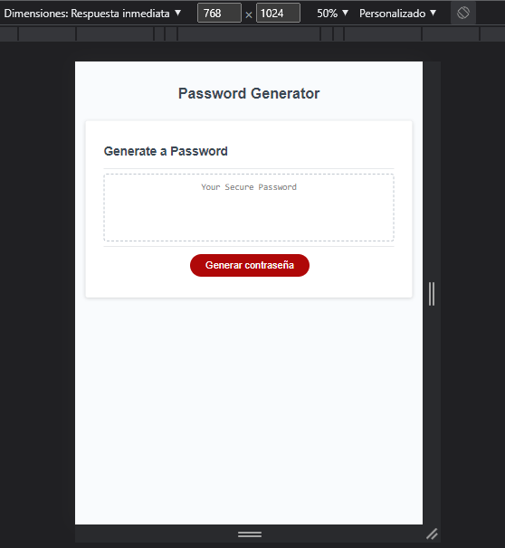
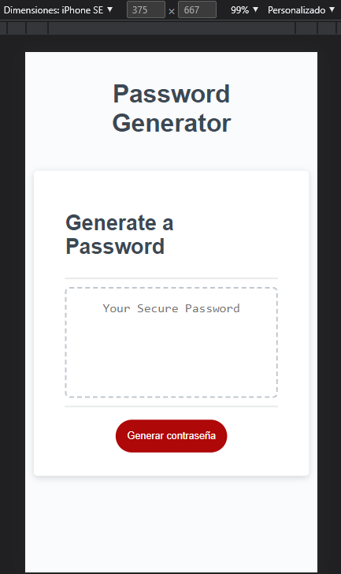
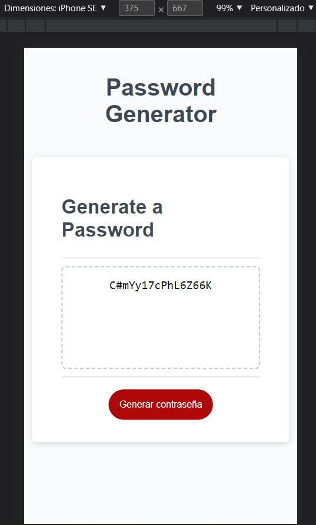

# 📖 Password Generator

# Project about generating a random password, indicated in 'prompts' the length of 8 or more characters, as well as the use of special characters.

## 💡Application deployed 💡
 
* [Link](https://carlosgortiz.github.io/passwordGenerator/) to web application. 
* [Link](https://github.com/carlosgortiz/passwordGenerator) to remote repository. 

## 🏆Application running 🏆

# Responsive design

## 
##

## 
##
